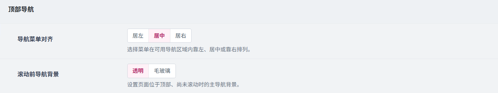
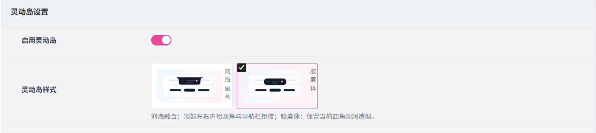
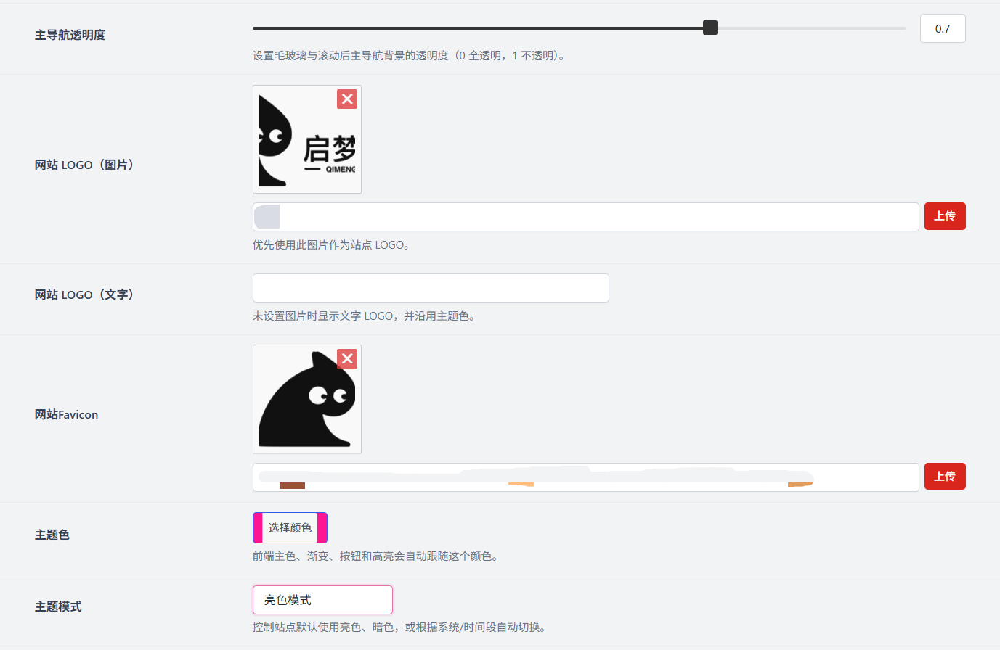
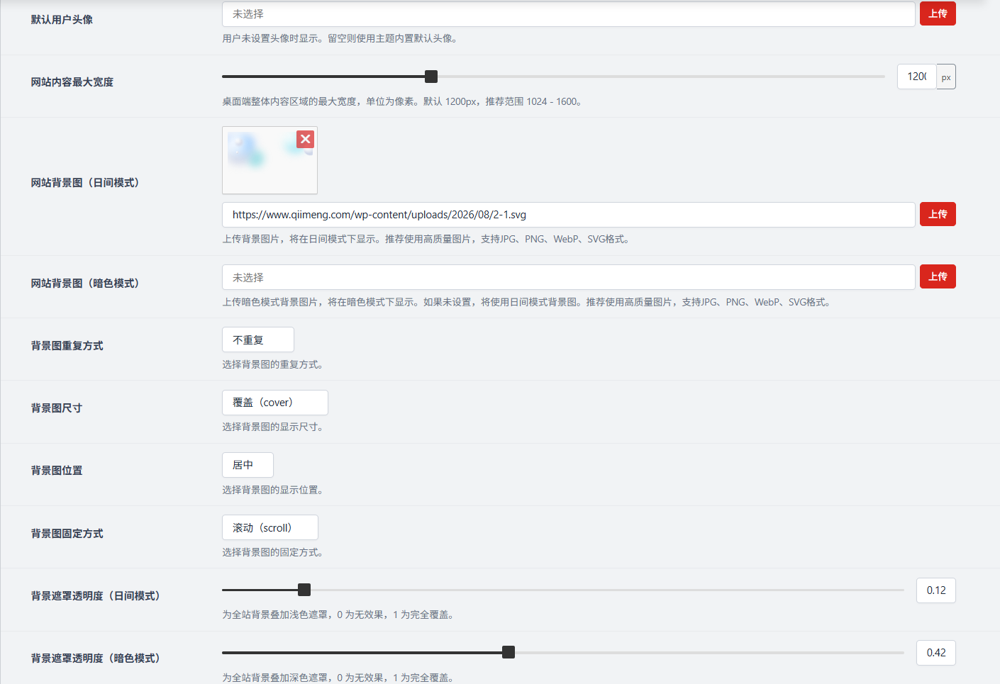

# 基础外观
作者：[阿城](https://www.hidesg.ink/)

## 顶部导航

**导航菜单对齐**

选择菜单在可用导航区域内靠左、居中或靠右排列。

**滚动前导航背景**

设置页面位于顶部、尚未滚动时的主导航背景。

## 灵动岛设置

**启用灵动岛**

启用后，会在网站前端显示一个灵动岛小组件，展示个人中心信息。

**灵动岛样式**

刘海融合：顶部左右内拐圆角与导航栏衔接；胶囊体：保留当前四角圆润造型。

## 首页设置

**主导航透明度**

设置毛玻璃与滚动后主导航背景的透明度（0 全透明，1 不透明）。

**网站Logo（图片）**

您站点的Logo图片。上传个人头像后，图像将显示在**首页左上角位置上**

:::warning 警告
开启之后和 网站Logo（文字） 冲突
:::

**网站logo（文字）**

您站点的Logo文字。输入后，Logo文字将显示在首页左上角位置上。

:::warning 警告
开启之后和 网站Logo（图片） 冲突
:::

**网站Favicon**

上传站点 Logo 或填写 URL，浏览器标题中的站点图标将会引用该值

**主题色**

前端主色、渐变、按钮和高亮会自动跟随这个颜色。

**主题模式**

控制站点默认使用亮色、暗色，或根据系统/时间段自动切换。

**默认用户头像**

用户未设置头像时显示。留空则使用主题内置默认头像。

**网站内容最大宽度**

桌面端整体内容区域的最大宽度，单位为像素。默认 1200px，推荐范围 1024 - 1600。

**网站背景图（日间模式）**

上传背景图片，将在日间模式下显示。建议使用高质量图片，支持JPG、PNG、WebP、SVG格式。

**网站背景图（暗色模式）**

上传暗色模式背景图片，将在暗色模式下显示。如果未设置，将使用日间模式背景图。建议使用高质量图片，支持JPG、PNG、WebP、SVG。

**背景图重复方式**

选择背景图的重复方式。

**背景图尺寸**

选择背景图的显示尺寸。

**背景图位置**

选择背景图的固定方式。

**背景图固定方式**

选择背景图的固定方式。

**背景遮罩透明度（日间模式）**

为全站背景叠加浅色遮罩，0 为无效果，1 为完全覆盖。

**背景遮罩透明度（暗色模式）**

为全站背景叠加深色遮罩，0 为无效果，1 为完全覆盖。