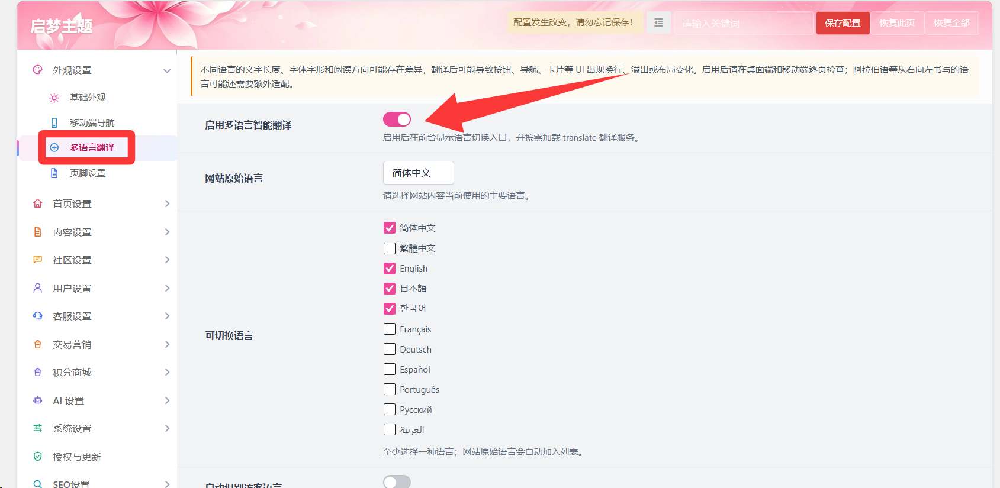
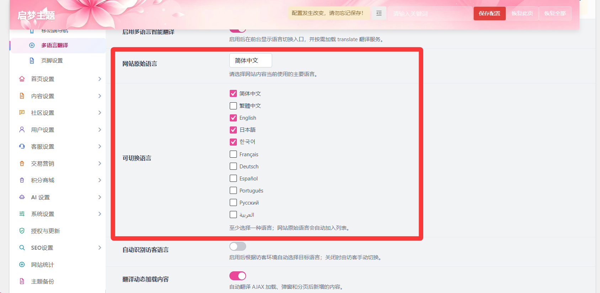
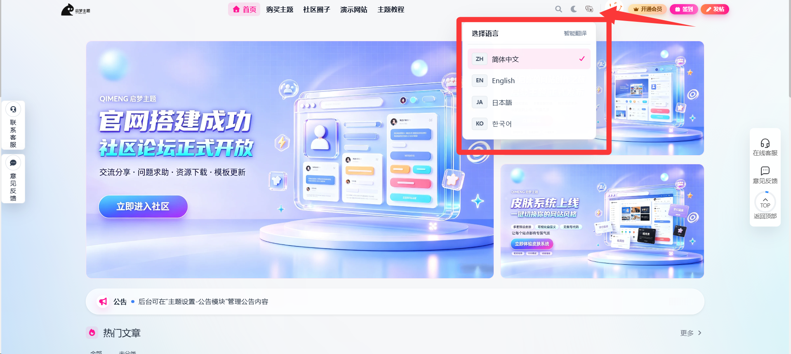
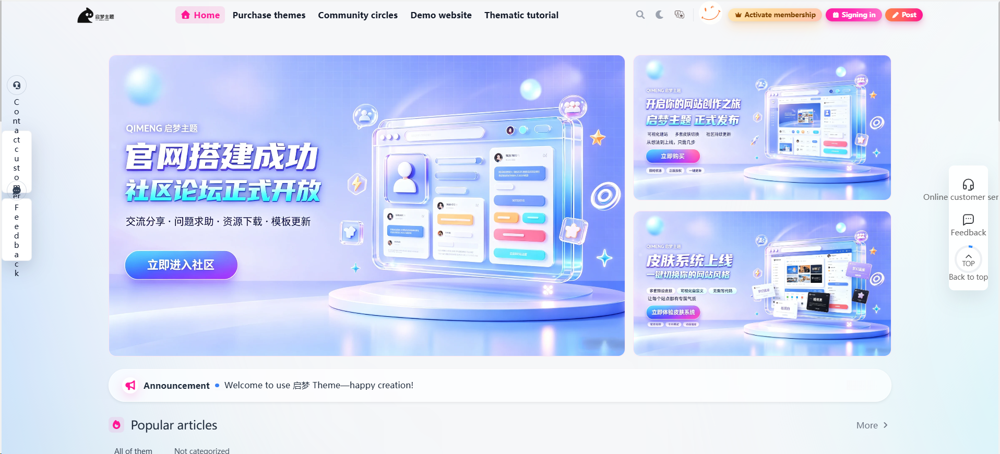
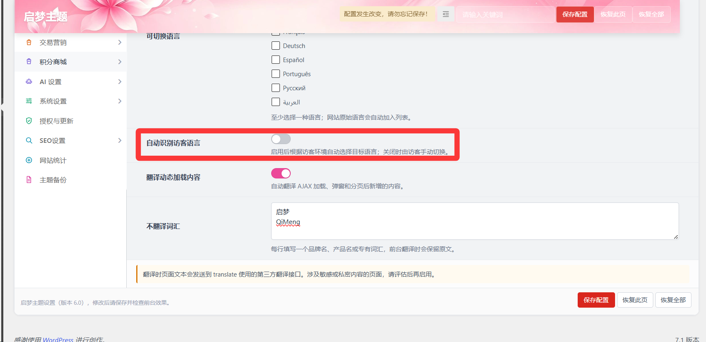
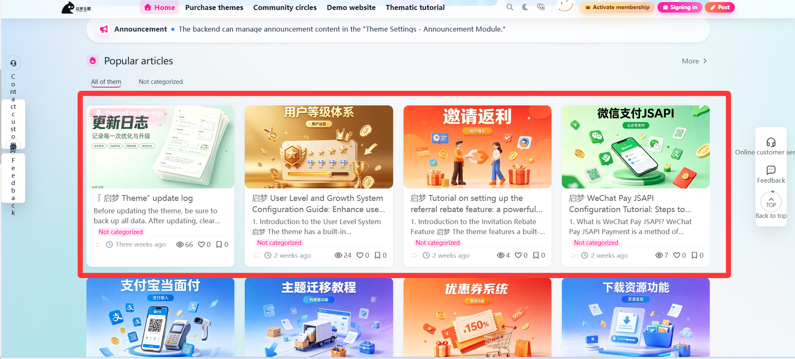
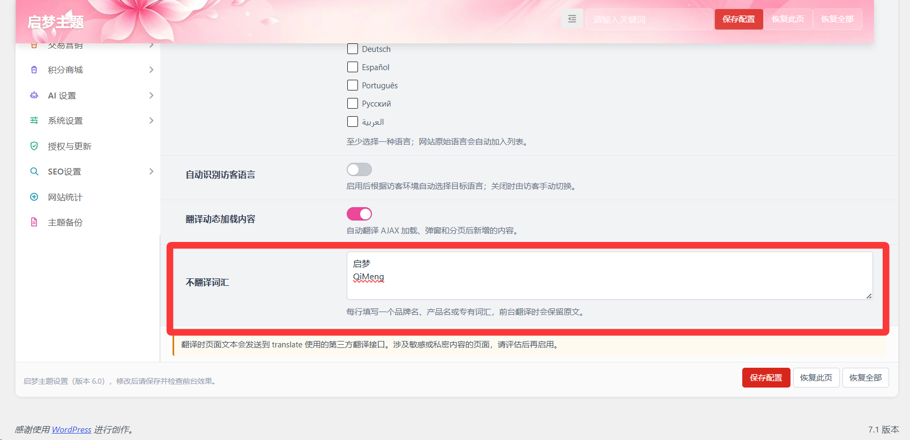

# 多语言翻译

作者：水鱼AIE

## 多语言翻译

::: warning

不同语言的文字长度、字体字形和阅读方向可能存在差异，翻译后可能导致按钮、导航、卡片等 UI 出现换行、溢出或布局变化。启用后请在桌面端和移动端逐页检查；阿拉伯语等从右向左书写的语言可能还需要额外适配。
:::

::: warning

翻译时页面文本会发送到 translate 使用的第三方翻译接口。涉及敏感或私密内容的页面，请评估后再启用。
:::

多语言翻译是一个网站国际化的一部分，你可以在外观设置>多语言翻译下开启

下方可以设置网站原始语言（用户刚进入网站显示的语言）和可切换的语言

勾选了可切换的语言后网站的上方菜单栏的**选择语言**小菜单中会显示，选择后网站会自动翻译到对应语言

开启自动识别访客语言后会根据访客的环境自动切换选择的语言

翻译动态加载内容，开启后自动翻译 AJAX 加载、弹窗和分页后新增的内容。

开启后：

没开启：

不翻译词汇的功能，不需要翻译的词汇每一行存在一个，不需要标点符号断行，通常用于网站名称、LOGO等。

