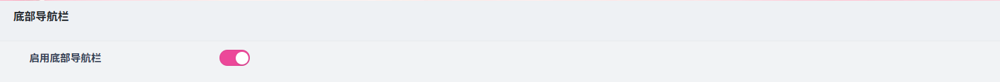
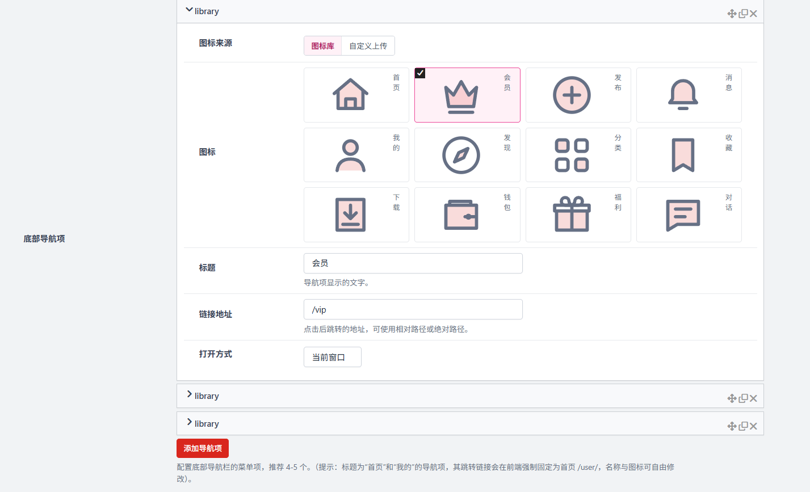
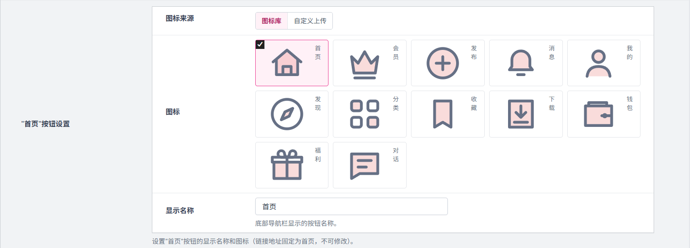
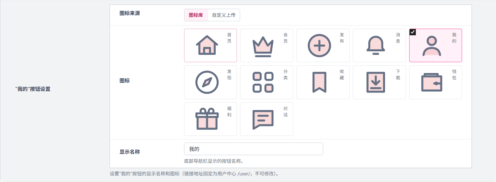

# 移动端设置
作者：[阿城](https://www.hidesg.ink/)

## 底部导航栏

**启用底部导航栏**

开启后，网站（尤其是移动端）会在页面底部显示固定的导航栏，包含首页、分类、我的、发布等核心入口；关闭后，底部导航栏将隐藏，用户需要通过其他方式（如侧边栏、顶部菜单）访问这些功能。

### 底部导航项

**图标来源**

图标库：使用内置的开源图标库，选择丰富、加载速度快，适合快速搭建。
自定义上传：上传自己设计的图标（如 PNG/SVG），可打造完全品牌化的视觉风格。

**图标 / 自定义图标**

在主题内置图标库选择图标或自定义上传自己的图标。

**标题**

导航项显示的文字标签，用于向用户说明该入口的功能。

**链接地址**

点击后跳转的目标地址，支持：
相对路径：如 /categories
绝对路径：如 https://example.com/categories

**打开方式**

当前窗口：在当前页面内跳转，保持用户浏览流的连续性。
新窗口：在新标签页打开，适合外链或需要保留当前页面的场景。

## 固定导航项设置

### "首页"按钮设置

**图标来源**

图标库：使用内置的开源图标库，选择丰富、加载速度快，适合快速搭建。
自定义上传：上传自己设计的图标（如 PNG/SVG），可打造完全品牌化的视觉风格。

**图标 / 自定义图标**

在主题内置图标库选择图标或自定义上传自己的图标。

**显示名称**

导航项显示的文字标签，用于向用户说明该入口的功能。

### "我的"按钮设置

**图标来源**

图标库：使用内置的开源图标库，选择丰富、加载速度快，适合快速搭建。
自定义上传：上传自己设计的图标（如 PNG/SVG），可打造完全品牌化的视觉风格。

**图标 / 自定义图标**

在主题内置图标库选择图标或自定义上传自己的图标。

**显示名称**

导航项显示的文字标签，用于向用户说明该入口的功能。

