# 页脚设置

作者：水鱼AIE

## 基础设置

开启启动页脚功能之后网站的下方就会显示页脚

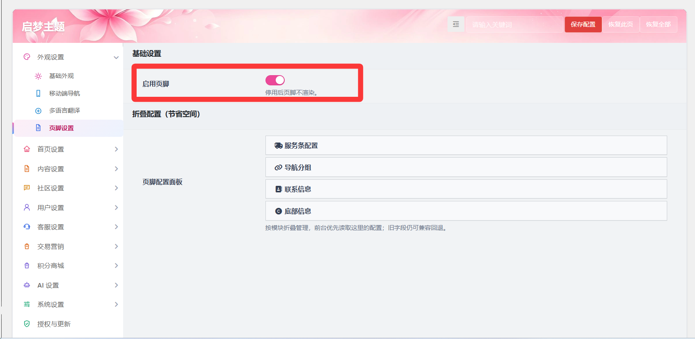

### 折叠配置

详细配置和前端显示如下对照

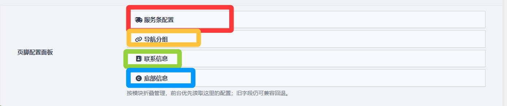

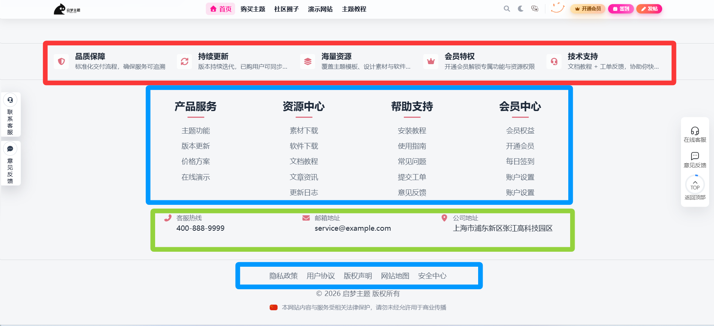

#### 服务条配置

可以配置其中的图标、标题、副主题来切换显示内容。可以通过右侧的十字移动来切换显示的左右位置，点击X键可以删除。

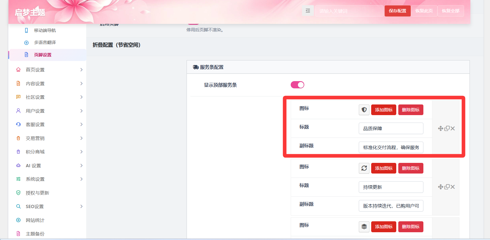

当添加的数量一行装不下的时候会自动扩展到下一行

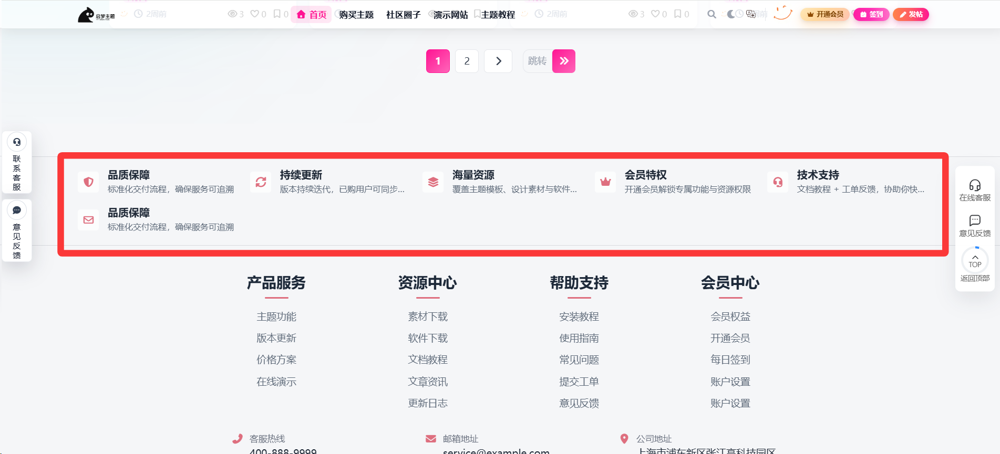

友情链接功能可以在页脚部分增加点击后可以跳转的标签

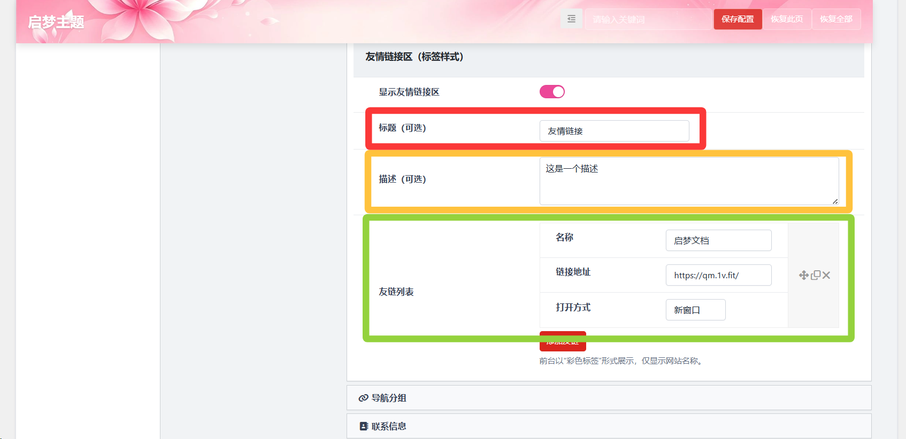

友情列表中可以配置名称、描述，跳转连接以及跳转的方式，主要设置的位置对应如下：

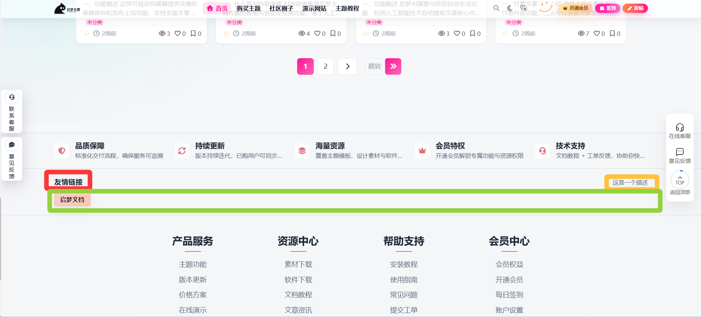

#### 导航分组

导航分组的基本样式是一个分组包括几个连接

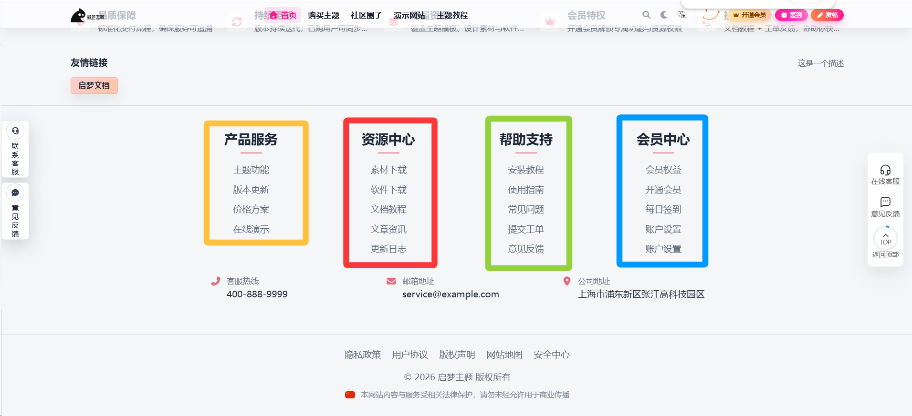

在导航分组设置中可以设置分组标题和链接列表的连接，同时更改显示的顺序

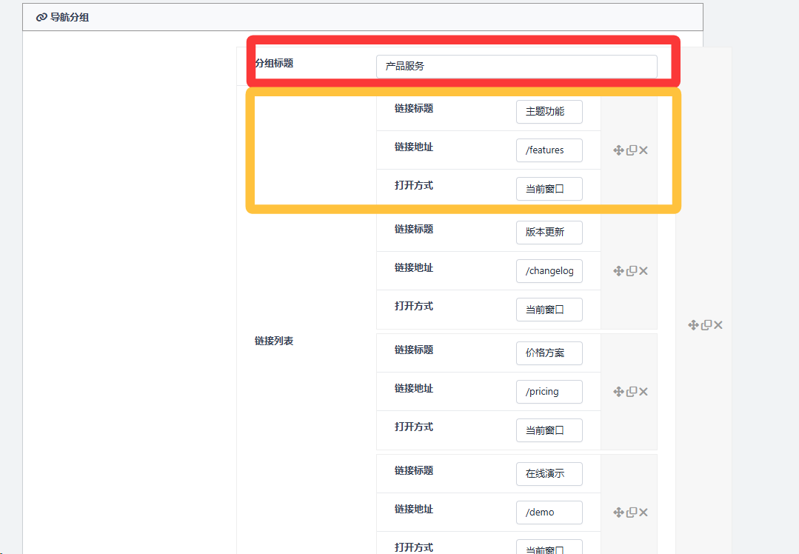

#### 联系信息

联系信息可以设置联系栏标题、电话标签的主题名称、联系电话、邮箱标签名、联系邮箱、地址标签名、公司地址位置，并且可以上传二维码显示在联系信息的位置，访问者可以扫码来获取信息/加入群聊。

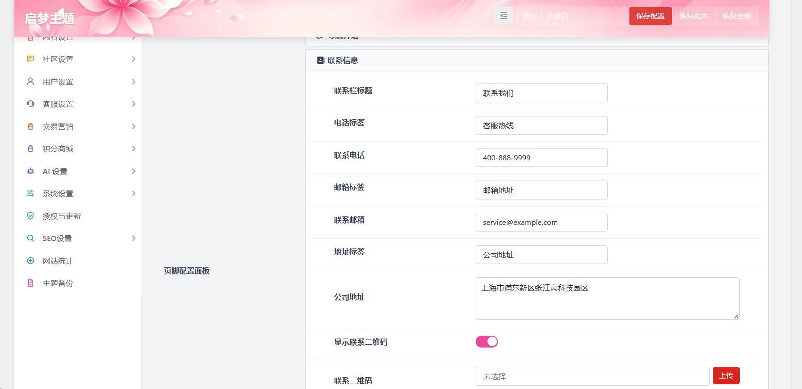

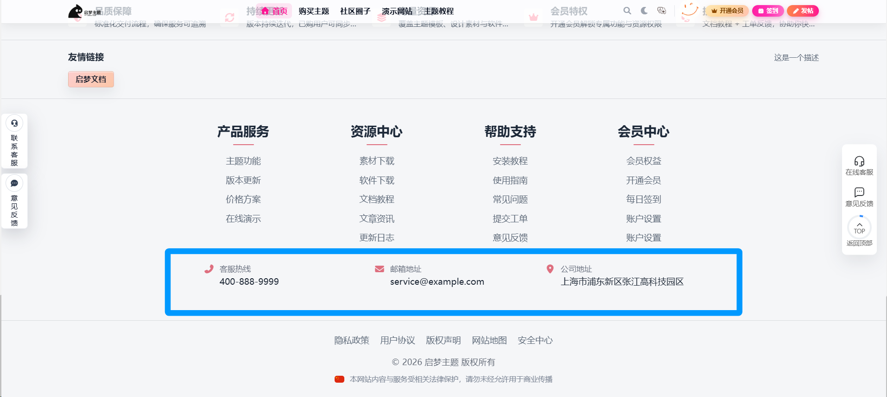

#### 底部信息

##### 底部政策连接

底部政策连接可以设置连接的标题、地址、打开方式，可以放入网站关键的政策内容或者规则以及重要页面。

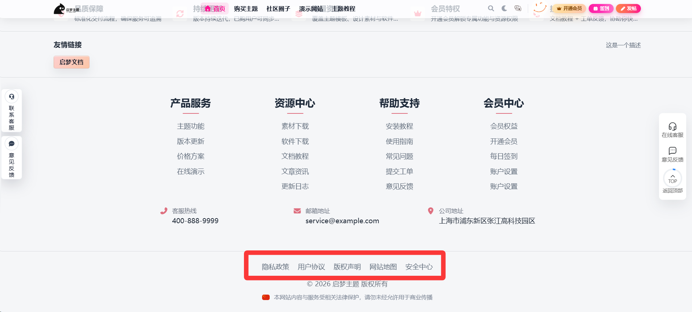

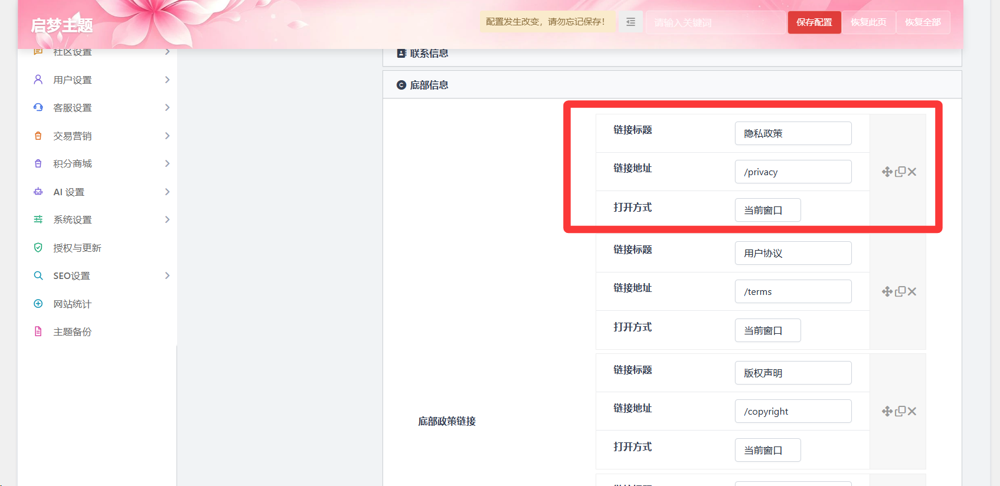

##### 版权和ICP备案

你可以在底部找到在网站底部显示版权文案和ICP备案号的设置界面，来显示备案网站的备案信息。

##### 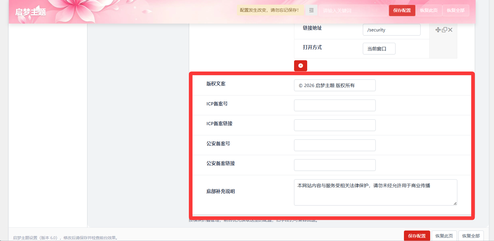

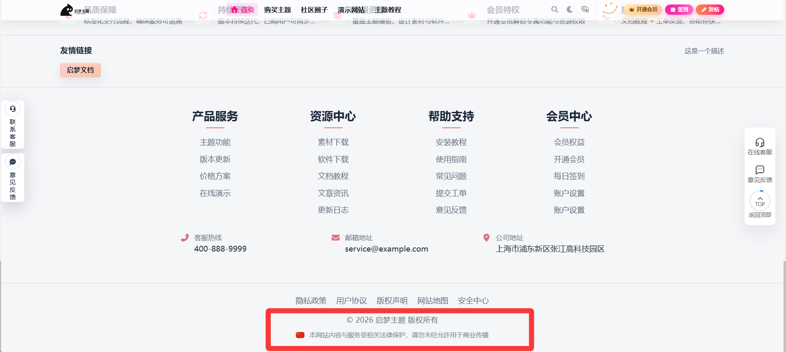