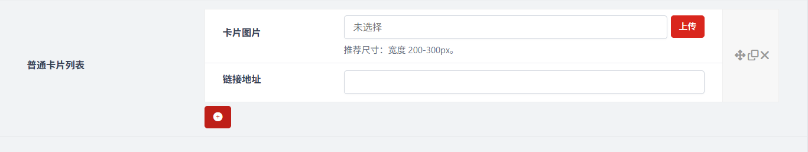
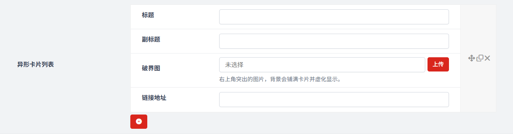

# 卡片模块
作者：[阿城](https://www.hidesg.ink/)

### 启用卡片模块

### 卡片样式

### 普通卡片列表

这是用于设置页面中内容卡片视觉外观的配置选项，通过切换样式来满足不同的设计需求。

### 异形卡片列表

这是异形卡片样式下的具体内容配置面板，用于创建带视觉特效的可跳转卡片。

### 移动端显示数量

这是用于控制移动端页面中卡片 / 内容项一行展示个数的配置选项，同时会对超出数量的内容进行隐藏，以适配手机等小屏设备的浏览体验。