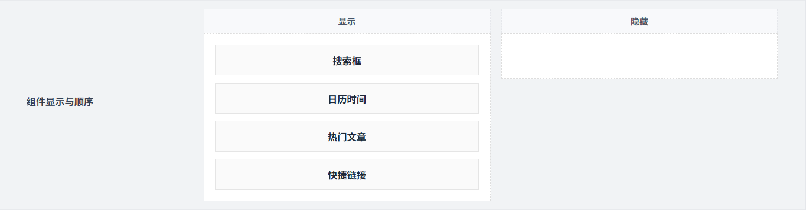
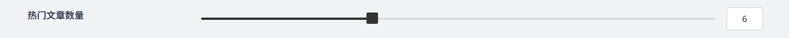
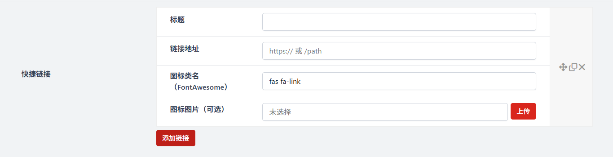

# 幻灯片叠加模组
作者：[阿城](https://www.hidesg.ink/)

## 启用叠加组件

这个开关用于控制是否开启 “叠加组件” 功能

## 组件显示与顺序

这个界面用于管理页面侧边栏 / 模块区的组件展示状态与排列顺序，你可以通过这个界面自由定制页面侧边栏 / 模块区的内容和布局，让页面更符合你的使用需求。

## 热门文章数量

这个界面用于控制 “热门文章” 组件在页面上显示的文章条数。

## 快捷链接

这个界面用于创建和配置首页幻灯片上的快捷入口链接。

